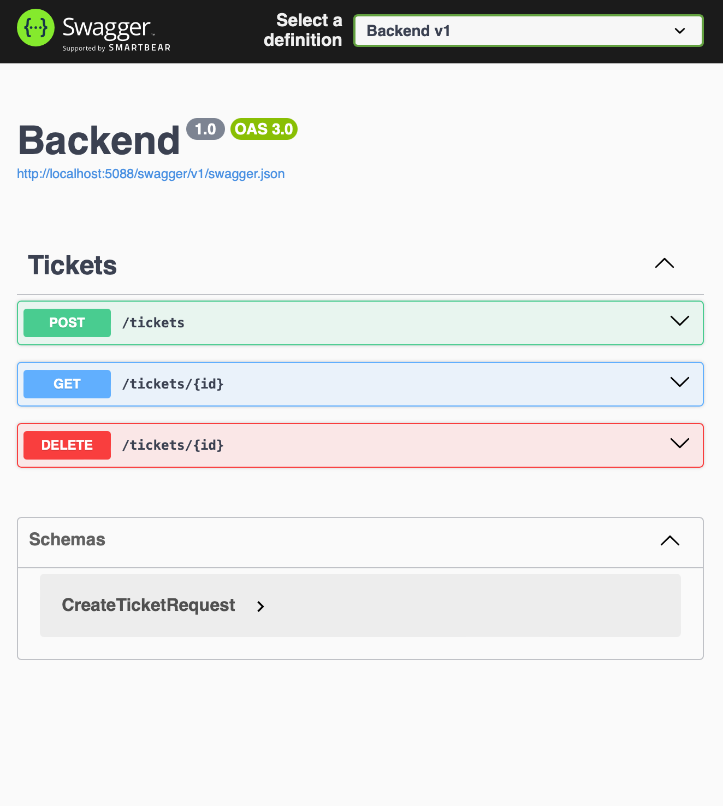

# 🎫 Ticket System – Full-Stack Web Application

Ein Full-Stack Ticket-System zur Erstellung und Verwaltung von Support-Anfragen.
Der Fokus liegt auf sauberem REST-API-Design, persistenter Datenspeicherung
und externer Workflow-Automatisierung.

---

## 🚀 Features
- Erstellung von Support-Tickets über ein Web-Frontend
- RESTful API mit CRUD-Endpunkten (POST / GET / DELETE)
- Persistente Speicherung mit SQLite
- Automatisierte E-Mail-Benachrichtigung bei Ticket-Erstellung
- Logging der Ticket-Daten in Google Sheets über n8n Workflows

---

## Architektur 

Frontend (HTML / CSS / JavaScript)  
→ ASP.NET Core REST API  
→ Entity Framework Core + SQLite  
→ n8n Webhook  
→ E-Mail Versand & Google Sheets

---

## Tech Stack
- Backend: ASP.NET Core (C#), Entity Framework Core
- Database: SQLite
- Frontend: HTML, CSS, Vanilla JavaScript
- Integration: n8n Cloud, Webhooks
- Tooling: Swagger, Git

---

## Workflow-Integration (n8n)
- Kommunikation über Webhooks
- Secret-basierte Validierung der Requests
- Definierte HTTP-Responses (200 / 401)
- Automatisierter E-Mail-Versand nach Ticket-Erstellung

---

## Testing
- API-Tests über Swagger UI
- End-to-End-Tests vom Frontend bis zur E-Mail-Auslieferung
- Debugging von CORS-, HTTP- und Webhook-Problemen

---

## 📸 Screenshots

### REST API (Swagger / OpenAPI)

### Frontend – Ticket erfolgreich erstellt

### n8n Workflow (Webhook → Mail → Google Sheets)

### Logging in Google Sheets

